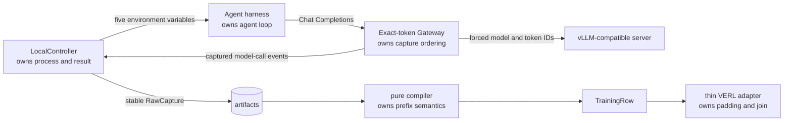

# RolloutBridge

English | [简体中文](README.zh-CN.md)



RolloutBridge is a small Python 3.12 bridge from agent rollouts to VERL training batches.
Its design is organized around explicit ownership: the harness owns the agent loop, the
Gateway owns serving-time token IDs and request ordering, the Controller owns subprocess
results and artifacts, the pure compiler owns prefix and loss-mask semantics, and the VERL
adapter owns only lossless joins and tensor translation.

It is not a rollout service or a trainer framework. Importing `rolloutbridge` does not load
torch, VERL, vLLM, or LangChain.

## Installation

```bash
uv sync --extra examples --group dev
```

The base runtime contains only Pydantic, FastAPI, httpx, and uvicorn. Example and CUDA
dependencies live in the `examples` and `train` extras. The reference training combination is
fixed to `verl==0.8.0` and `vllm==0.20.2`.

Those releases declare conflicting NumPy constraints: VERL declares NumPy `<2`, while vLLM
requires NumPy 2. The decision to use vLLM's NumPy 2 side is documented explicitly as a uv
override in `pyproject.toml`; the real import and backward pass remain part of the GPU smoke
acceptance test.

## Local mock end-to-end test

No GPU or model download is required. The integration test starts real local HTTP Gateway and
fake-vLLM servers, then runs both independent harnesses through a
`model → calculator → model` trajectory:

```bash
uv run pytest tests/test_integration.py -v
```

Run the complete local acceptance suite with:

```bash
uv run pytest
uv run ruff format --check .
uv run ruff check .
uv run pyright
uv build
uv run python -I -c "import rolloutbridge"
find src/rolloutbridge -name '*.py' -print0 | xargs -0 wc -l
```

## Run the Gateway and a rollout

The upstream URL is the root of an OpenAI-compatible server. The Gateway overrides `model` and
`return_token_ids` so the captured IDs come from the actual serving path; it never reconstructs
them with a local tokenizer.

```bash
uv run rolloutbridge-gateway \
  --upstream-base-url http://127.0.0.1:8000 \
  --model-id Qwen/Qwen2.5-0.5B-Instruct \
  --port 8001
```

The Controller accepts argv only and never invokes a shell:

```python
import asyncio
import sys

from rolloutbridge import LocalController, RolloutSpec

spec = RolloutSpec(
    rollout_id="sample-0",
    task_id="arithmetic",
    task={"question": "What is 6 * 7?", "answer": 42},
)
controller = LocalController(
    "http://127.0.0.1:8001",
    "artifacts",
    "Qwen/Qwen2.5-0.5B-Instruct",
)
result = asyncio.run(controller.run(spec, [sys.executable, "examples/openai_tool_agent/run.py"]))
```

The Controller writes `task.json` and injects exactly five harness-facing variables:

- `RB_ROLLOUT_ID`
- `RB_GATEWAY_BASE_URL`
- `RB_TASK_FILE`
- `RB_RESULT_FILE`
- `RB_MODE`

A harness may write only `reward` and `metrics` to `result.json`. The Controller derives
`status` and `exit_code` from the process, timeout, and file validity. A wrong answer is a
successful rollout with reward zero; protocol and tool errors exit unsuccessfully.

## Offline recompilation

Artifacts contain validated raw contracts rather than compiler output, so trajectory semantics
can evolve without rerunning an agent:

```python
from pathlib import Path

from rolloutbridge import RawCapture, compile_trajectory

capture = RawCapture.model_validate_json(
    Path("artifacts/rollout_sample-0.json").read_text(encoding="utf-8")
)
rows = compile_trajectory(capture.events, capture.result, capture.spec.task_id)
```

The initial prompt becomes a non-trainable `initial_context`. When the next prompt has the exact
previous `prompt + continuation` token prefix, new environment or tool tokens become
`context_delta(mask=0)` and model tokens become `model_response(mask=1)`. A broken prefix starts
a new row instead of guessing an alignment.

## One-GPU GRPO smoke test

On a Linux host with NVIDIA CUDA:

```bash
uv sync --frozen --extra examples --extra train
uv run python examples/grpo_smoke/train.py \
  --revision YOUR_HF_COMMIT_SHA
```

The script launches a small Qwen vLLM server with Hermes tool parsing and the same Gateway. It
tries four fixed arithmetic tasks independently, sampling each `task_id` at most sixteen times,
and stops at the first group with both zero and one rewards. It constructs a real VERL
`DataProto`, calls VERL 0.8.0's GRPO advantage and PPO policy-loss functions, loads the same
Hugging Face actor revision, and performs a real backward/AdamW step. Finite loss, a positive
gradient norm, and a changed parameter probe are required; all `RawCapture` files and a JSON
terminal summary are retained.

## Explicit boundaries

- Chat Completions only: `stream=false`, `n=1`, single-process in-memory Gateway.
- A successful upstream response without `prompt_token_ids` or first-choice `token_ids` fails
  with 502. There is no local retokenization fallback.
- No rollout REST state machine, retries, attempts, authentication, database, Kubernetes,
  hooks, model registry, pause/drain, asynchronous training, W&B, or trainer lifecycle.
- The compiler can represent multi-row rollouts. The v0.1 VERL export explicitly rejects them,
  along with failed or missing rewards, ambiguous joins, and overlong sequences. It never
  truncates or treats a row as a rollout.
- The GPU smoke test is the acceptance path for the pinned stack, not a promise that every CUDA,
  driver, vLLM, or VERL environment runs without host-specific installation changes.

## Inspiration and license

RolloutBridge is an original MIT-licensed implementation inspired by
[Microsoft Agent Lightning v1.0.0](https://github.com/microsoft/agent-lightning/tree/v1.0.0)
(baseline commit `8f8b8f95`), specifically its exact-token Gateway, trajectory-prefix
aggregation, and local subprocess injection. It does not copy Agent Lightning's rollout state
machine, large VERL trainer, or vendored `llm-in-sandbox` code.
