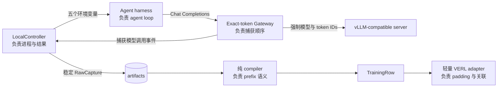

# RolloutBridge

[English](README.md) | 简体中文



RolloutBridge 的核心主张是明确 ownership：agent loop 属于 harness，serving-time token
与并发顺序属于 Gateway，进程结果与 artifact 属于 Controller，token prefix 与 loss mask
属于纯 compiler，VERL adapter 只负责无损关联和张量翻译。它不是另一套 rollout 服务或 trainer。

v0.1 是一个很小的 Python 3.12 bridge：代理非流式、单 choice 的 Chat Completions，保存模型
服务实际使用的 token IDs，把连续多轮调用编译成 exact-token trajectory，再构造 VERL
`DataProto`。Core 不会在 import 时加载 torch、VERL、vLLM 或 LangChain。

## 安装

```bash
uv sync --extra examples --group dev
```

基础运行时只有 Pydantic、FastAPI、httpx 和 uvicorn。示例与 CUDA/VERL 分别位于
`examples`、`train` 可选依赖中；训练参考组合固定为 `verl==0.8.0` 与 `vllm==0.20.2`。
这两个版本的发布元数据对 NumPy 上限互相冲突：v0.1 在 `pyproject.toml` 中显式采用 vLLM
所需的 NumPy 2 override，并把真实 import/backward 留给 GPU smoke 验收。

## 本机 mock E2E

无需 GPU 或模型下载。测试会启动真实 HTTP fake-vLLM 与 Gateway，并让两套相互独立的
harness 各自完成一次 `model → calculator → model`：

```bash
uv run pytest tests/test_integration.py -v
```

完整本机验收：

```bash
uv run pytest
uv run ruff format --check .
uv run ruff check .
uv run pyright
uv build
uv run python -I -c "import rolloutbridge"
find src/rolloutbridge -name '*.py' -print0 | xargs -0 wc -l
```

## 运行 Gateway 与 rollout

Gateway 的 upstream URL 是 OpenAI-compatible 服务根地址；请求中的 `model` 和
`return_token_ids` 会被覆盖，以保证捕获来自 serving 路径而非本地重分词。

```bash
uv run rolloutbridge-gateway \
  --upstream-base-url http://127.0.0.1:8000 \
  --model-id Qwen/Qwen2.5-0.5B-Instruct \
  --port 8001
```

Controller 只接受 argv，不经过 shell：

```python
import asyncio
import sys

from rolloutbridge import LocalController, RolloutSpec

spec = RolloutSpec(
    rollout_id="sample-0",
    task_id="arithmetic",
    task={"question": "What is 6 * 7?", "answer": 42},
)
controller = LocalController(
    "http://127.0.0.1:8001",
    "artifacts",
    "Qwen/Qwen2.5-0.5B-Instruct",
)
result = asyncio.run(controller.run(spec, [sys.executable, "examples/openai_tool_agent/run.py"]))
```

Controller 为 harness 写入 `task.json`，并只注入以下接口：

- `RB_ROLLOUT_ID`
- `RB_GATEWAY_BASE_URL`
- `RB_TASK_FILE`
- `RB_RESULT_FILE`
- `RB_MODE`

Harness 的 `result.json` 只能含 `reward` 与 `metrics`。`status` 和 `exit_code` 由
Controller 根据进程、超时和文件有效性推导。错误答案是成功 rollout，reward 为 0；协议或
工具错误以非零状态退出。

## 离线重编译

Artifact 只保存原始契约，不保存 compiler 派生物，因此可以在不重新运行 agent 的情况下升级
编译逻辑：

```python
from pathlib import Path

from rolloutbridge import RawCapture, compile_trajectory

capture = RawCapture.model_validate_json(
    Path("artifacts/rollout_sample-0.json").read_text(encoding="utf-8")
)
rows = compile_trajectory(capture.events, capture.result, capture.spec.task_id)
```

每行首个 prompt 是不可训练的 `initial_context`。如果下一次 prompt 以此前完整
`prompt + continuation` 为精确 token prefix，新增环境/tool token 作为
`context_delta(mask=0)`，模型 token 作为 `model_response(mask=1)`；若 prefix 断裂则开始
新 row，不猜测 alignment。

## 单 GPU GRPO smoke

在装有 NVIDIA CUDA 的 Linux 主机运行：

```bash
uv sync --extra examples --extra train
uv run python examples/grpo_smoke/train.py
```

脚本启动小型 Qwen vLLM 和同一个 Gateway，对同一 `task_id` 最多采样 8 次。只有得到非零
reward 方差才继续；随后构造真实 `DataProto`，调用 VERL 0.8.0 的 GRPO advantage 与 PPO
policy-loss，加载同一 Hugging Face actor 并执行一次真实 backward/AdamW step。它断言 loss
有限、参数 checksum 改变，并保留所有 `RawCapture` 与 JSON 终端摘要。

## 明确边界

- 仅支持 Chat Completions、`stream=false`、`n=1`、单进程内存 Gateway。
- 成功上游响应缺少 `prompt_token_ids` 或首个 choice 的 `token_ids` 时返回 502；绝不本地重分词。
- 不提供 rollout REST 状态机、retry/attempt、认证、数据库、Kubernetes、hooks、模型注册、
  pause/drain、异步训练、W&B 或 trainer 生命周期。
- Compiler 可表达一个 rollout 的多 row；v0.1 VERL export 明确拒绝 multi-row rollout，也拒绝
  failed/missing reward、关联歧义和超长序列，不截断、不把 row 当 rollout。
- GPU smoke 是 pinned-stack 验收入口，不是对所有 CUDA、driver、vLLM 或 VERL 环境
  “零改动运行”的承诺；不同主机仍可能需要与其驱动匹配的安装调整。

## 来源与许可

实现从零编写，MIT licensed。设计参考
[Microsoft Agent Lightning v1.0.0](https://github.com/microsoft/agent-lightning/tree/v1.0.0)
（基线 commit `8f8b8f95`）的 exact-token Gateway、trajectory prefix aggregation 与 local
subprocess injection。没有复制其 rollout 状态机、大型 VERL trainer 或 vendored
`llm-in-sandbox`。
